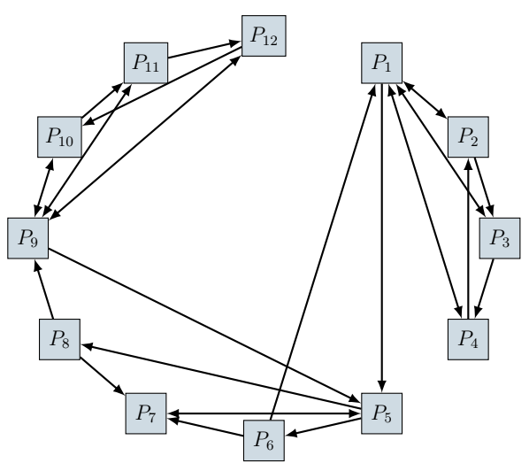

# Chaînes de Markov : page Rank de Google

L’ensemble des pages web disponibles sur l’Internet peut être représenté mathématiquement par un immense graphe, dans lequel chaque sommet est une page web $ P*i $, et dans lequel on ajoute une flèche de $ P_i $ vers $ P_j $ si la page $ P_i $ contient un lien hypertexte vers la page $ P_j $. Ci-dessous, un exemple de graphe pour 12 pages fictives $ P_1 $, $ P_2 $, ..., $ P_{12} $, ainsi que la matrice d’adjacence $ A $ associée 



$
A = 
\left(
\begin{array}{c|cccccccccccc}
 & 1 & 2 & 3 & 4 & 5 & 6 & 7 & 8 & 9 & 10 & 11 & 12 \\ \hline
1 & 0 & 1 & 1 & 1 & 0 & 0 & 0 & 0 & 0 & 0 & 0 & 0 \\
2 & 1 & 0 & 1 & 0 & 0 & 0 & 0 & 0 & 0 & 0 & 0 & 0 \\
3 & 1 & 0 & 0 & 1 & 0 & 0 & 0 & 0 & 0 & 0 & 0 & 0 \\
4 & 1 & 1 & 0 & 0 & 0 & 0 & 0 & 0 & 0 & 0 & 0 & 0 \\
5 & 0 & 0 & 0 & 0 & 1 & 1 & 1 & 0 & 0 & 0 & 0 & 0 \\
6 & 1 & 0 & 0 & 0 & 0 & 1 & 0 & 0 & 0 & 0 & 0 & 0 \\
7 & 0 & 0 & 0 & 1 & 0 & 0 & 0 & 0 & 0 & 0 & 0 & 0 \\
8 & 0 & 0 & 0 & 0 & 0 & 0 & 1 & 0 & 0 & 0 & 0 & 0 \\
9 & 0 & 0 & 0 & 1 & 0 & 0 & 0 & 1 & 0 & 0 & 0 & 0 \\
10 & 0 & 0 & 0 & 0 & 0 & 0 & 0 & 0 & 1 & 0 & 1 & 1 \\
11 & 0 & 0 & 0 & 0 & 0 & 0 & 0 & 0 & 1 & 0 & 0 & 1 \\
12 & 0 & 0 & 0 & 0 & 0 & 0 & 0 & 0 & 1 & 1 & 0 & 0 \\
\end{array}
\right)
$

## Étape 1 : Importer les bibliothèques nécessaires


```python
import numpy as np
```

La bibliothèque numpy permet de manipuler des matrices et des vecteurs efficacement en Python.

## Étape 2 : Définir la matrice d'adjacence A

La matrice d'adjacence $ A $ représente les connexions entre les pages web. Si une page $ i $ pointe vers une page $ j $, alors `A[i][j] = 1`. Sinon, `A[i][j] = 0`.


```python
# Définition de la matrice d'adjacence A
A = np.array([
    [0, 1, 1, 1, 1, 0, 0, 0, 0, 0, 0, 0],
    [1, 0, 1, 0, 0, 0, 0, 0, 0, 0, 0, 0],
    [1, 0, 0, 1, 0, 0, 0, 0, 0, 0, 0, 0],
    [1, 1, 0, 0, 0, 0, 0, 0, 0, 0, 0, 0],
    [0, 0, 0, 0, 0, 1, 1, 1, 0, 0, 0, 0],
    [1, 0, 0, 0, 0, 0, 1, 0, 0, 0, 0, 0],
    [0, 0, 0, 0, 1, 0, 0, 0, 0, 0, 0, 0],
    [0, 0, 0, 0, 0, 0, 1, 0, 1, 0, 0, 0],
    [0, 0, 0, 0, 1, 0, 0, 0, 0, 1, 1, 1],
    [0, 0, 0, 0, 0, 0, 0, 0, 1, 0, 1, 0],
    [0, 0, 0, 0, 0, 0, 0, 0, 1, 0, 0, 1],
    [0, 0, 0, 0, 0, 0, 0, 0, 1, 1, 0, 0]
])
```

## Étape 3 : Calculer la matrice de probabilité P

Pour que les valeurs dans chaque ligne de la matrice représentent des probabilités, on divise chaque élément de la ligne par le nombre de liens sortants (ou connexions) de la page correspondante.


```python
# Calcul de la matrice de probabilité P
P = np.zeros_like(A, dtype=float)  # Matrice P de la même taille que A avec des 0
for i in range(A.shape[0]):
    liens = np.sum(A[i, :])  # Somme des éléments de la ligne i
    if liens > 0:  # Evite la division par zéro
        P[i, :] = A[i, :] / liens
```

Explication :

- Pour chaque ligne $ i $ dans $ A $, on calcule le nombre de liens sortants.
- Si une page a au moins un lien sortant, chaque élément de la ligne est divisé par ce nombre.
- Ainsi, chaque ligne de $ P $ contient des valeurs de probabilité qui représentent les chances de suivre chaque lien sortant de la page $ i $.

## Étape 4 : Initialiser le vecteur X0

Le vecteur $ X_0 $ est notre vecteur d'état initial, qui représente la probabilité d'être sur chaque page au tout début. Ici, on initialise $ X_0 $ avec la première page ayant une probabilité de 1 et toutes les autres à 0.


```python
# Création du vecteur X0
X0 = np.zeros(A.shape[0])
X0[0] = 1  # On initialise X0 avec 1 dans la première case
```

## Étape 5 : Calculer le vecteur de probabilité Xn

On itère pour mettre à jour les probabilités jusqu'à convergence (stabilisation des valeurs). À chaque étape, le nouveau vecteur $ X_{n+1} $ est obtenu en multipliant l'état actuel $ X_n $ par la matrice de probabilité $ P $.


```python
# Calcul de Xn
Xn = X0
Xn1 = Xn @ P
while not np.array_equal(Xn1, Xn):  # Boucle jusqu'à convergence
    Xn = Xn1
    Xn1 = Xn @ P
```

Explication :

- Tant que le vecteur $ X_{n+1} $ diffère de $ X_n $, on met à jour $ X_n $.
- La condition de la boucle `np.array_equal(Xn1, Xn)` permet de vérifier si les probabilités sont stabilisées (pas de changement entre deux itérations).

## Étape 6 : Afficher le classement des pages

Pour afficher le classement des pages, on trie les valeurs de $ X_{n+1} $ en ordre décroissant. Ensuite, on affiche les pages et leurs scores PageRank.


```python
# Affichage des résultats
Vrang = np.sort(Xn1)[::-1]  # Trie des valeurs de Xn en ordre décroissant
rangP = np.argsort(Xn1)[::-1]  # Indices des pages triées

print("Classement des pages web selon PageRank :")
for i in range(len(rangP)):
    print(f"Page {rangP[i] + 1} : PageRank = {Xn1[rangP[i]]}")

```

    Classement des pages web selon PageRank :
    Page 5 : PageRank = 0.17647058823529382
    Page 1 : PageRank = 0.11764705882352926
    Page 7 : PageRank = 0.11764705882352922
    Page 9 : PageRank = 0.11764705882352917
    Page 4 : PageRank = 0.058823529411764636
    Page 3 : PageRank = 0.058823529411764636
    Page 2 : PageRank = 0.058823529411764636
    Page 8 : PageRank = 0.05882352941176461
    Page 6 : PageRank = 0.05882352941176461
    Page 12 : PageRank = 0.05882352941176458
    Page 11 : PageRank = 0.05882352941176458
    Page 10 : PageRank = 0.05882352941176458


Explication :

- `np.sort(Xn1)[::-1]` trie les valeurs en ordre décroissant. <br>
- `np.argsort(Xn1)[::-1]` obtient les indices des pages dans l'ordre décroissant de leur PageRank. <br>
- On utilise une boucle pour afficher chaque page avec son score PageRank.
